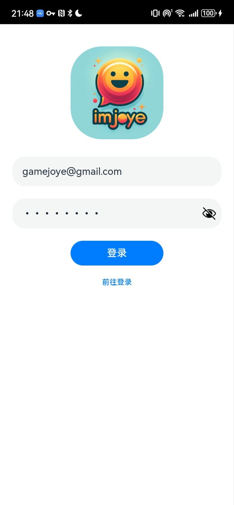
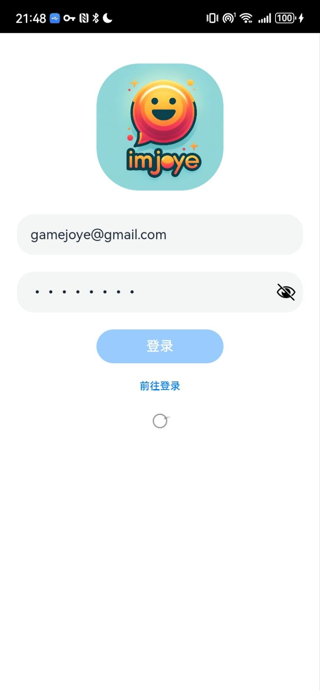
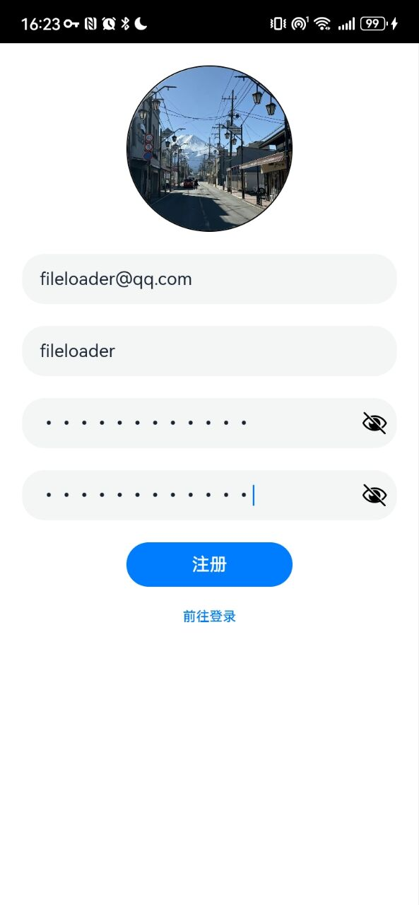
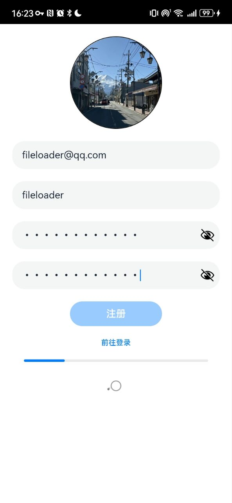
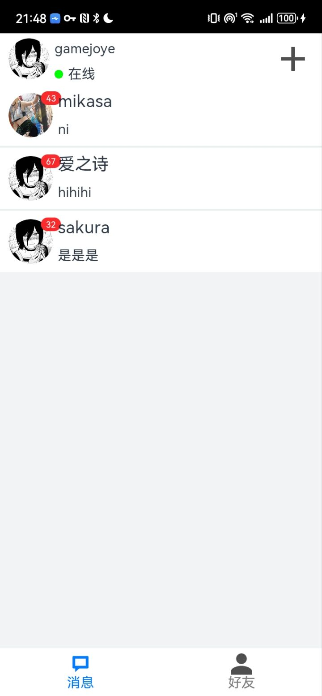
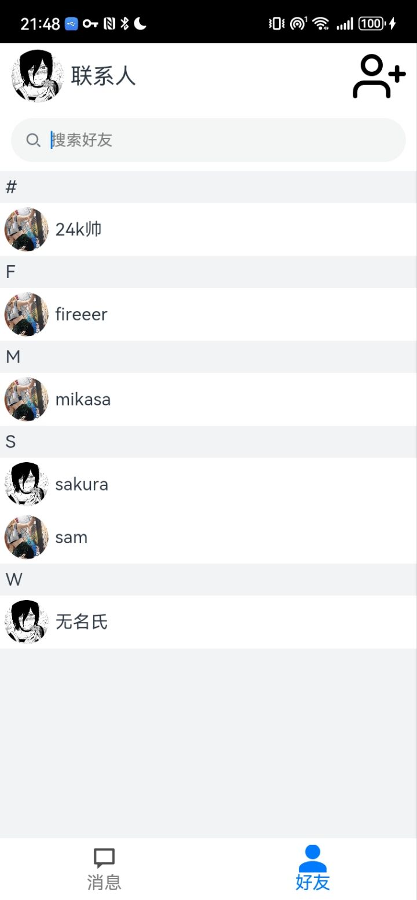
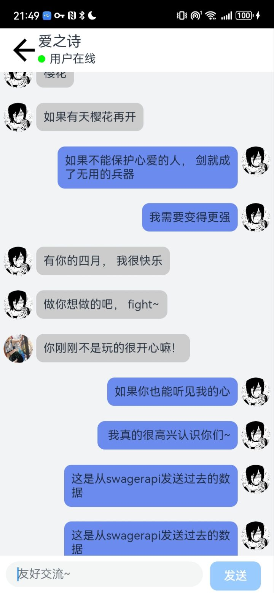
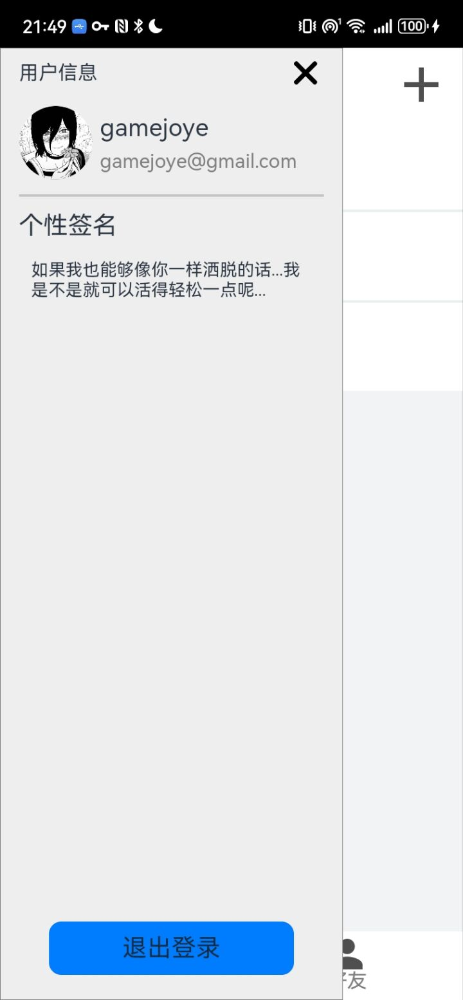
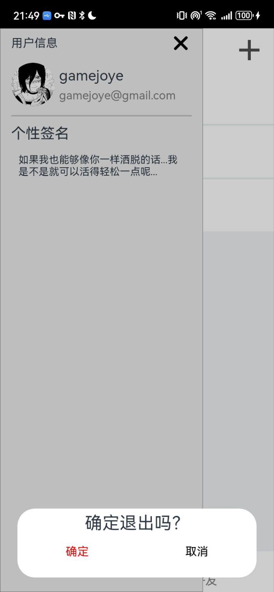
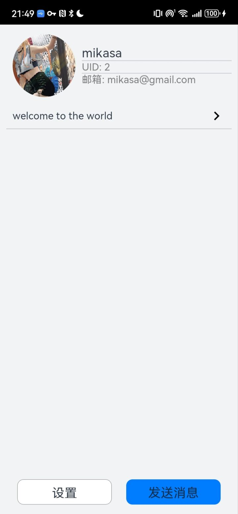

# 鸿蒙IM即时聊天项目

这是一个基于鸿蒙**Arkts**开发的即时通讯（IM）项目，旨在提供一个高效、可靠的即时消息交换平台。项目支持单聊、群聊等核心即时通讯功能，并专注于提供稳定的在线状态跟踪和离线消息处理。

## 目前实现的功能
- **单聊**：用户之间可以进行私人对话，实时发送和接收消息。
- **群聊**：群组内的成员可以互相发送和接收消息。

## 目前实现的优化
- **消息的可靠性**：计划采用TCP(SYN/ACK)策略在应用层实现消息的可靠性，保证消息的正确送达。

## 待实现的基础功能
- **好友申请**：用户之间可以发送好友请求
- **创建群聊**：用户可以创建多人聊天室

## 待优化的地方
- **虚拟长列表**：虚拟长列表，按需加载列表信息
- **连接可靠性**：通过心跳机制保证即使在用户闲置状态下也能保持连接不断开，提高系统的稳定性。

## 部分功能效果图

- 登录界面

- 登录等待界面

- 注册界面

- 注册等待界面

- 相册选取头像界面

- 主页-聊天室列表界面

- 主页-好友列表界面

- 聊天界面

- 用户信息界面

- 用户登录对话框界面

- 好友信息界面

### 后端设置

后端代码位于 [nestjs-chat](https://github.com/gamejoye/nestjs-imjoye)，**请确保你在运行本项目之前正确启动了nestjs-chat项目**

~~后端项目的配置过程将在不久后提供~~

#### 环境要求

- HarmonyOS 3.1 Release Api9(移动端)
- Node.js 20.10.0(后端)
- MySQL 8.0.27
